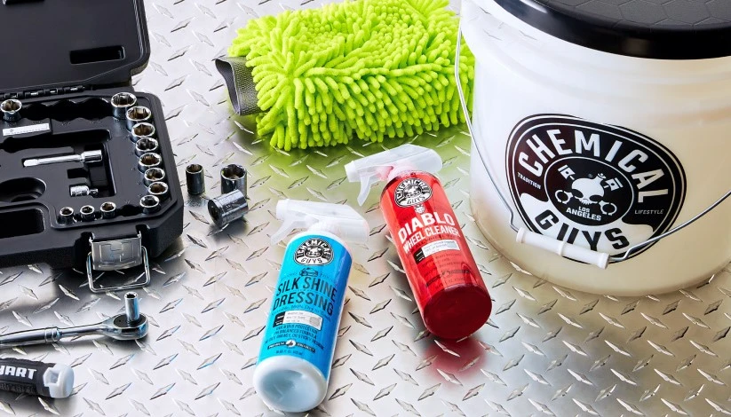

**Standard Clean Steps：Interior > Wheel > Exterior**

### Interior (內裝)

*   **Interior Clean (清潔)**
    *   Meguiar's D101 Detailer All Purpose Cleaner (稀釋 1:10)
    *   SONAX Multi-Purpose Auto Interior Cleaner
    *   Collinite Leather & Vinyl Treatment Wax #855 (清潔兼保護)
*   **Interior Care (保養/抗UV/增亮)**
    *   3M PN38143 雙效皮革乳液
    *   Meguiar's Ultimate Protectant, G14716
    *   Meguiar's Ultimate Interior Detailer, G16216
    *   Turtle Wax DASH & GLASS INTERIOR DETAILER
    *   Turtle Wax INSIDE & OUT CAR PROTECTANT

---

**Exterior Steps：Wash > Clay > Compound > Polish > Glaze > Sealant > Wax > Detailer**

### Entry Level Products List (Rookie Detailers)

#### 1. Compound / Correction 研磨拋光 (去除細紋/刮痕)
> *此區產品含有研磨顆粒，用於移除金油層瑕疵。*
*   **Heavy Cut (粗蠟/重研磨):**
    *   Finish Kare BWM 114: Rubbing Compound
    *   Poorboy's Master Cut Super Cut Compound
    *   Poorboy's SSR3
    *   Meguiar's Ultimate Compound, G17216
*   **Polish / AIO (細拋/清潔蠟 - 含微量研磨):**
    *   Turtle Wax Hybrid Solutions Ceramic Polish & Wax (AIO)
    *   Turtle Wax Hybrid Solutions Pro 1 & Done (可調整研磨劑)
    *   Collinite 631 (Fleetwax) / 920 (Fiberglass Cleaner)

#### 2. Glaze 填縫/增豔 (掩蓋細紋/提升光澤)
> *此區產品通常不含研磨劑也不具備長效保護，主要用於"填補"細紋並增加深邃感。*
*   Poorboy's White Diamond (淺色車用) / Black Hole (深色車用)
*   3M Hand Glaze 5990 (純填縫劑，無保護力)

#### 3. Sealant 封體 (人造合成蠟 - 長效保護)
> *此區為強調持久性與抗腐蝕的合成產品。*
*   **Finish Kare 1000P**: Hi-Temp Paste Wax
*   Finish Kare 2180 / 118 (Sealant Conditioner)
*   Meguiar's M21 Synthetic Sealant
*   Poorboy's EX Sealant with Carnauba
*   3M 39030 Performance Finish
*   Collinite 476S / 885 (耐久型混合蠟)
*   Meguiar's M27 SiO2 (Plastic Safe)
*   Turtle Wax Ice Paste Wax
*   Turtle Wax Hybrid Solutions Pro to The Max Wax (液態封體蠟)

#### 4. Carnauba Wax 棕櫚蠟 (天然蠟 - 增強水潤感)
> *此區強調亮度與撥水，通常疊在封體之上。*
*   Finish Kare #2685: Cherry Pink Paste Wax
*   3M Perfect-It Boat Wax 36112/36113
*   Collinite 915 (Marque D'Elegance) / 845 (Insulator Wax)
*   Poorboy's World Liquid Natty's Blue / Red
*   Turtle Wax Super Hard Shell (傳統硬殼蠟)

#### 5. Spray Wax / Detailer 維護劑 (收水/除塵/補充保護)
*   **Quick Detailer (清潔/潤滑用):**
    *   Meguiar's Quik Detailer Mist & Wipe, A3316
    *   Meguiar's D155 Last Touch Spray Detailer
*   **Spray Wax/Sealant (噴霧封體/維護):**
    *   Meguiar's Ultimate Quik Detailer, G14422 (UQD)
    *   Meguiar's M799 Pro Hybrid Ceramic Bead Booster
    *   Turtle Wax Hybrid Solutions Ceramic Wax 3-in-1 Detailer
    *   Turtle Wax Express Shine Carnauba Spray (噴霧蠟)
    *   Turtle Wax Pro Graphene Flex Wax
    *   Turtle Wax Ceramic Spray Wax Coating (CSC)

---

### Ref：
*   [Meguiars's 5 Step Paint Care](https://meguiarsonline.com/forum/information-station/how-to-articles/66299-meguiar-s-5-step-paint-care-cycle)
*   [Turtle Wax: How To Detail A Car Completely](https://www.turtlewax.com/blogs/how-to/the-complete-car-detailing-guide)
